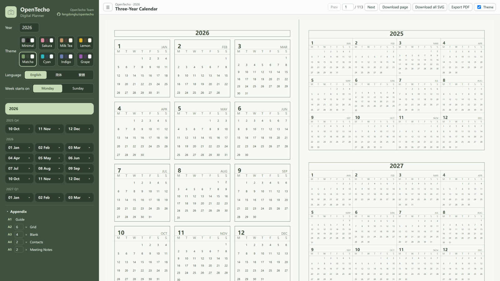
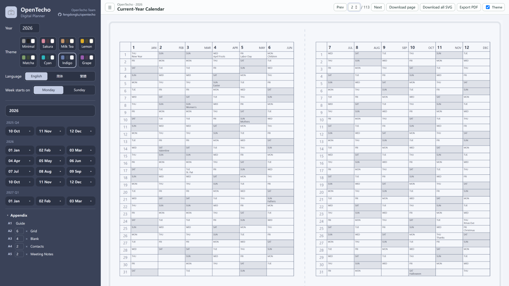
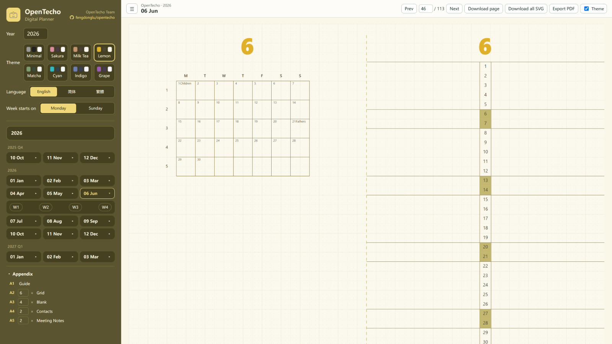
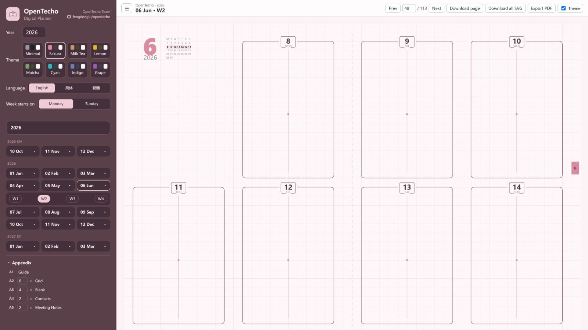
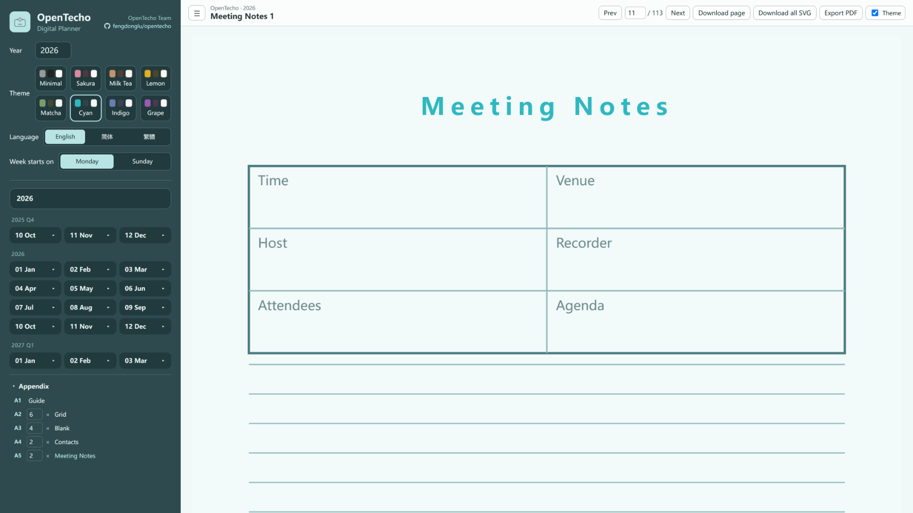

# OpenTecho · 电子手帐

开源电子手帐生成器。网页即用、无需安装，按固定次序生成跨年手帐页面，支持 SVG / PDF 导出。

> English version: [README.md](README.md)

**在线体验：https://fengdonglu.github.io/OpenTecho/**

## 特性

- **网页即用**：纯前端，无需安装，全部数据本地处理、不上传
- **可安装、可离线（PWA）**：在浏览器中「安装」为应用，首次访问后断网也能继续使用
- **记住设置**：年份 / 主题 / 语言 / 每周起始 / 附录数量会保存在本地，刷新后自动恢复
- **跨年编排**：上年 Q4（10–12 月）→ 全年（1–12 月）→ 次年 Q1（1–3 月），每月后接当月周页
- **内置农历与节日**：农历换算（基于 [lunar-javascript](https://github.com/6tail/lunar-javascript)）、法定假日与民间节日标记
- **多主题**：极简 / 樱花 / 奶茶 / 柠檬 / 抹茶 / 青 / 靛蓝 / 葡萄，可切换「主题色 / 黑白灰」导出
- **多语言**：简体中文 / 繁體中文 / English
- **每周起始可配置**：周一 / 周日
- **导出**：SVG（逐页或全部）、PDF（200dpi JPEG，B6 单页 125×176mm、对开 B5 250×176mm），带进度与取消

## 界面截图

| 三年年历 | 当年年历 |
| --- | --- |
|  |  |
| **月历** | **周历** |
|  |  |



## 技术栈

Vue 3 · TypeScript · Vite · Pinia · jsPDF · lunar-javascript

## 快速开始

```bash
npm install
npm run dev     # 开发服务器 http://localhost:3000
npm run build   # 类型检查 + 生产构建
```

## 项目结构

```
src/
├── components/preview/   # SVG 预览组件
├── generators/           # 手帐文档编排（跨年次序）
├── locales/              # 中英文文案
├── stores/               # Pinia 状态
├── templates/            # 页面模板：三年年历/当年年历/月度/周度/使用说明/方格/空白/通讯录/会议记录
├── types/                # 类型定义
└── utils/                # 日期、农历、节日、SVG、PDF、下载
public/                   # favicon 等静态资源
```

## 使用说明

1. 设置年份、主题、每周起始、语言
2. 左侧目录按「年度总览 → 上年 Q4 → 全年 → 次年 Q1 → 附录」排列，点击跳转
3. 附录包含「使用说明」以及可自定义数量的「方格纸」「空白页」「通讯录」「会议记录」
4. 右侧预览当前页，可翻页或直接输入页码跳转
5. 下载 SVG（逐页 / 全部）或导出 PDF

## Roadmap

> 目前仅实现了 PAL 方法论的一小部分。

- [ ] 年度 slogan（主题词）：年初填写，供年底回顾对照
- [ ] 本年回顾页：与年初 slogan 对照
- [ ] 更多 PAL 方法论功能（待梳理）
- [ ] 附录内容扩充：候选——24 节气表、生肖/干支年份对照、常用换算
- [ ] 核心引擎抽离为 NPM 包（`@opentecho/core`）

## 部署

- **GitHub Pages**：push 到 `main`/`master` 自动构建部署（见 `.github/workflows/deploy.yml`）。部署后的站点即 PWA——打开后使用浏览器的「安装」即可作为离线应用使用。
- **自托管**：push `v*` 标签触发 release 工作流，自动构建 `dist` 并打包成 zip 上传到 release，下载解压后用任意静态服务器托管即可。注意：PWA 的安装/离线需要以 **http(s)** 方式访问（如 `npx serve dist`）；直接用 `file://` 双击打开 `index.html` 不可用。

## 致谢

本项目是「不是闷」PAL 手帐的程序化实现，其独特的「工字轴」布局创意来自 PAL。感谢作者的巧思，建议关注原作以了解更多使用巧思。

基于 Vibe Coding 开发。

## 许可证

[GPL-3.0](LICENSE)

## 作者

[OpenTecho Team](https://github.com/fengdonglu/OpenTecho)
